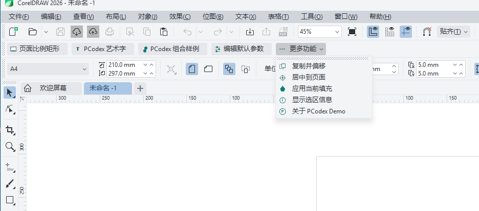

# CorelDRAW WPF Toolbar Addon Template

基于 C#、WPF 和 CorelDRAW `.addon` 加载机制的开发模板，用于创建在 CorelDRAW 进程内运行的 x64 工具栏插件。

模板已提供可工作的工具栏、命令宿主、示例对话框、资源 DLL 生成脚本，以及自动安装和卸载脚本。业务代码通过宿主传入的 `Application` 对象进行 dynamic late binding，因此不依赖特定版本的 `Corel.Interop.VGCore` 程序集。



## 演示组件

截图展示的是模板安装到 CorelDRAW 后的运行状态，包含可直接复用或替换的以下组件：

- **主工具栏命令**：页面比例矩形、PCodex 艺术字和 PCodex 组合样例，演示从按钮事件到 CorelDRAW 文档对象操作的完整链路。
- **参数编辑入口**：`编辑默认参数` 打开 WPF 参数对话框；工具栏和对话框共享同一份 `ToolbarOptions` 运行时配置。
- **下拉菜单命令组**：`更多功能` 将次级操作收纳为菜单，示例包括复制并偏移、居中到页面、应用当前填充与显示选区信息。
- **图标和文案资源**：每个命令关联由 `config.xml` 映射的文本与图标；`Build-ToolbarResources.ps1` 会生成对应的资源 DLL。
- **辅助交互**：关于窗口用于展示插件信息，也可作为帮助、版本信息或设置页面的入口。

## 功能概览

- 原生 CorelDRAW 工具栏及 V5 工作区迁移文件
- WPF 工具栏控件与参数编辑对话框
- CorelDRAW 命令组封装，示例操作可作为一次撤销记录处理
- 示例命令：创建页面比例矩形、艺术字、组合样例、复制偏移、居中、填充和选区信息
- 自动生成工具栏图标资源 DLL
- 自动定位已安装的 CorelDRAW，并校验部署文件哈希

## 环境要求

- Windows x64
- 已安装的 CorelDRAW Graphics Suite（安装脚本从 Windows 注册表定位 `Programs64/Addons`）
- .NET Framework 4.8 Developer Pack / Targeting Pack
- Visual Studio 2022，包含“.NET 桌面开发”工作负载
- Windows 10/11 SDK（提供 x64 `rc.exe`）
- Visual Studio C++ x64 生成工具（提供 x64 `link.exe`，用于构建图标资源 DLL）

> 模板面向 64 位 CorelDRAW。首次部署前请关闭目标版本的 `CorelDRW.exe`。

## 快速开始

```powershell
git clone https://github.com/muchenkezhan/coreldraw-csharp-plugin-template.git
Set-Location "CorelDrawToolbar"
dotnet build ".\CorelDrawToolbar.sln" --configuration Debug --nologo
```

在 Visual Studio 中打开 `CorelDrawToolbar.sln`，主要从以下位置开始定制：

- `src/CorelDrawToolbar/ControlUI.xaml`：工具栏 UI
- `src/CorelDrawToolbar/Services/CorelDrawToolbarService.cs`：CorelDRAW 操作逻辑
- `src/CorelDrawToolbar/Models/ToolbarOptions.cs`：共享默认参数
- `src/CorelDrawToolbar/DemoDialog.xaml`：参数编辑对话框

同步修改插件标识时，请更新 `addon/CorelDrw.addon` 内的名称、GUID、版本和描述，并保持安装脚本中的目标目录名称一致。

## 构建

构建整个解决方案：

```powershell
dotnet build ".\CorelDrawToolbar.sln" --configuration Debug --nologo
```

构建 Release 版本：

```powershell
dotnet build ".\CorelDrawToolbar.sln" --configuration Release --nologo
```

安装脚本会在部署前自动构建程序集，并调用 `tools/Build-ToolbarResources.ps1` 生成 `addon/PCodexToolbarResources.dll`。仅在已经完成构建且想跳过重复构建时，才使用 `-SkipBuild`。

## 安装到 CorelDRAW

关闭目标版本的 CorelDRAW 后，在 PowerShell 中执行：

```powershell
.\tools\Install-Addon.ps1
```

脚本只有检测到一个 CorelDRAW，或能够根据最近使用的工作区判定目标版本时才会自动选择。多版本环境建议始终显式指定版本：

```powershell
.\tools\Install-Addon.ps1 -CorelVersion 2025 -Configuration Release
```

脚本会将以下文件部署至：

```text
<CorelDRAW 安装目录>\Programs64\Addons\CorelDrawToolbar
```

- `CorelDrw.addon`
- `AppUI-V5.xslt`
- `UserUI-V5.xslt`
- `config.xml`
- `PCodexToolbarResources.dll`
- `CorelDrawToolbar.dll`

部署完成后重新启动 CorelDRAW，在工具栏区域右键，启用 **PCodex Demo 工具栏**。如果旧工作区未刷新工具栏，请先备份自定义工作区，再按住 `F8` 启动 CorelDRAW 并确认重置，或创建新的工作区验证。

## 调试

1. 使用 Debug 配置安装插件。
2. 在 Visual Studio 中将调试器附加到 `CorelDRW.exe`。
3. 代码类型选择 `Managed (.NET Framework)`。
4. 修改后关闭 CorelDRAW，重新安装插件，再启动宿主进行验证。

请不要手动释放构造函数接收的 CorelDRAW `Application` COM 对象；也不要从后台线程直接访问 CorelDRAW 对象模型。

## 卸载

关闭目标版本的 CorelDRAW 后执行：

```powershell
.\tools\Uninstall-Addon.ps1 -CorelVersion 2025
```

卸载脚本会先检查部署目录中的 `CorelDrw.addon` 名称，确认属于本模板后才删除。

## 项目结构

```text
.
├── addon/                         # Addon 清单、UI 迁移文件和资源配置
├── src/CorelDrawToolbar/           # WPF 插件项目
│   ├── Services/                   # CorelDRAW 命令实现
│   ├── Models/                     # 参数模型
│   ├── ControlUI.xaml              # 工具栏界面
│   └── DemoDialog.xaml             # 示例参数对话框
├── tools/
│   ├── Build-ToolbarResources.ps1  # 生成工具栏资源 DLL
│   ├── Install-Addon.ps1           # 构建并部署插件
│   └── Uninstall-Addon.ps1         # 安全卸载插件
└── CorelDrawToolbar.sln
```

## 发布前检查

- 将 `PCodex` 品牌、示例命令和默认文案替换为实际产品内容。
- 为 `addon/CorelDrw.addon` 生成并填写唯一 GUID。
- 使用 Release 配置安装并在目标 CorelDRAW 版本中验证工具栏加载、命令执行和撤销行为。
- 更新仓库地址、许可证和 Issue 联系方式。

## License

请在发布前添加适合项目的许可证文件，并在此处说明许可范围。
